# Movie Tracer 

## Project Description
 The software allows managing movies’ information, 
 specifically, add information about a new movie, store 
 information related to a movie, add a movie to watched 
 movies or to wish list movies tables, delete a movie from 
 watched and wish list, as well as to visualize the data 
 of the movie list and watched list movies in pie charts.

## Getting started guide
- If a user opens the software for the first time, it will ask them 
to set up a database information (database location, database name, 
database user, database password) as well as to set up administrator username. 
That information will be stored in the file and will further be used to enter the program. 
- There are three possibility of users:
1. Unregistered user. Can only see the Movie Table and Movie Company Statistics. They should log in
  to start to use the software.
2. Registered user. In addition to that, can add a movie in the WatchedList Table and in the 
  WishList table. Go to those tables in order to manage them. Regular user's username and 
  password are existed by default to simplify user experience.
3. System administrator. Can also insert a movie in the MovieList table, insert/delete a company 
  in the CompanyList table. Go to the Tab menu to do that.
  

## Prerequisites
In order to get into the program for the first time and set a system admin, you need: 
- internet connection,
- established database connection (for example, PUTTY),
- to know your database credentials (database location, database name, database user (user name),
  and database password), 
- come up with appropriate password and username.
For using this program further you need:
- internet connection,
- remember your password and username in order to manage the tables.

## Screenshots
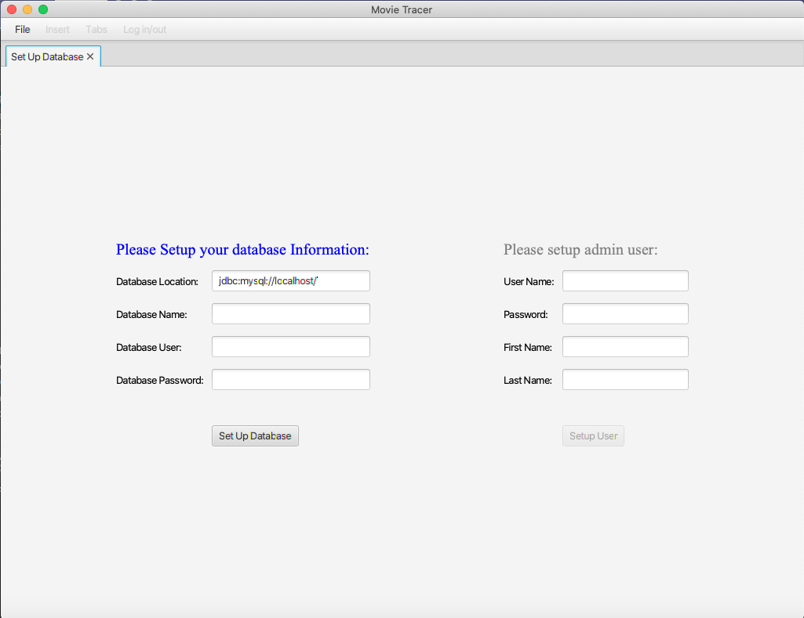 
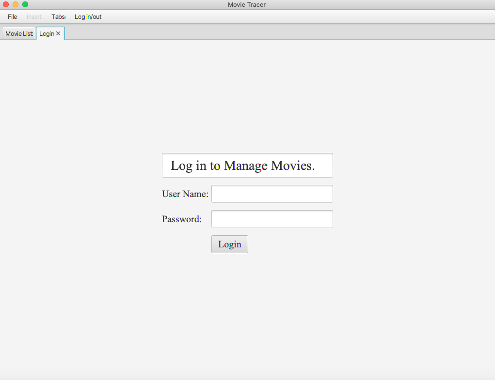
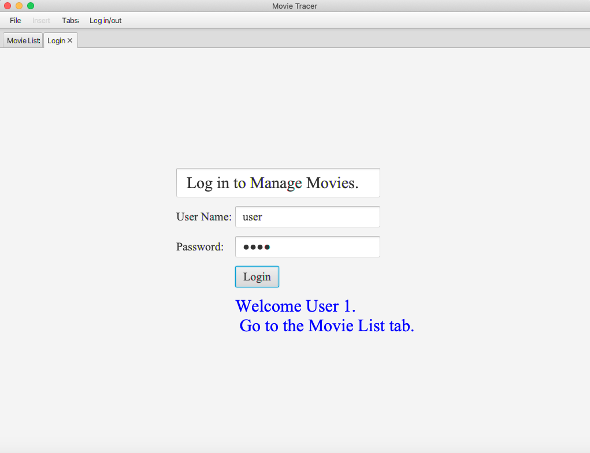
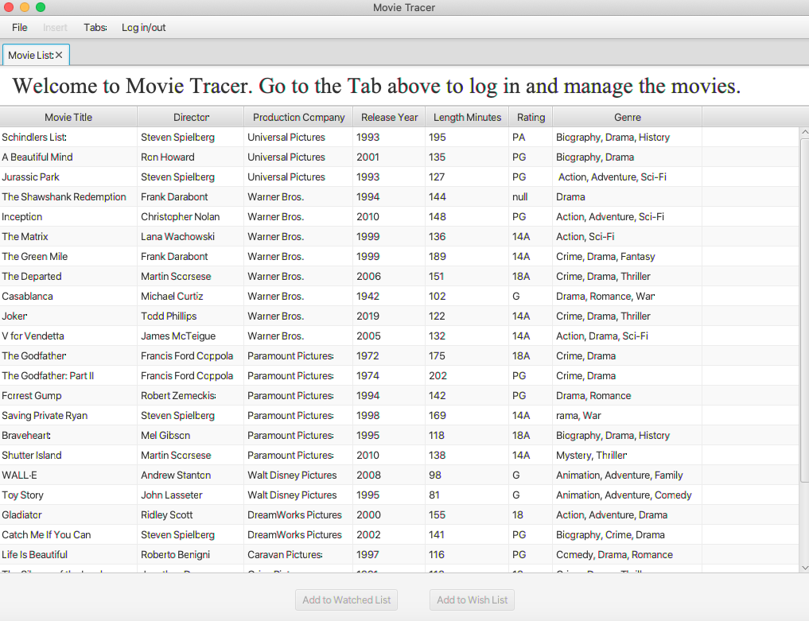
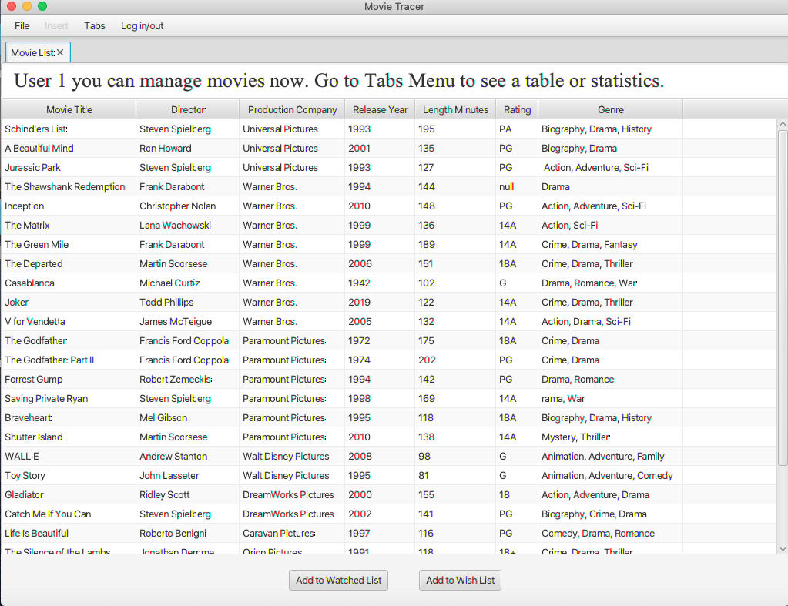
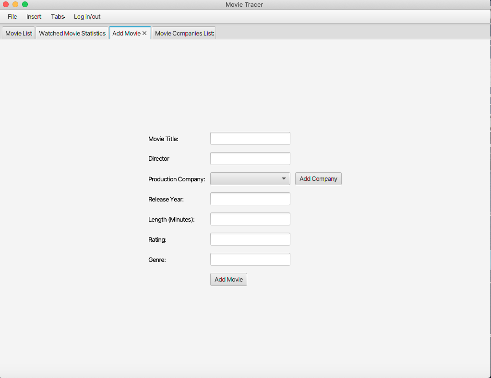
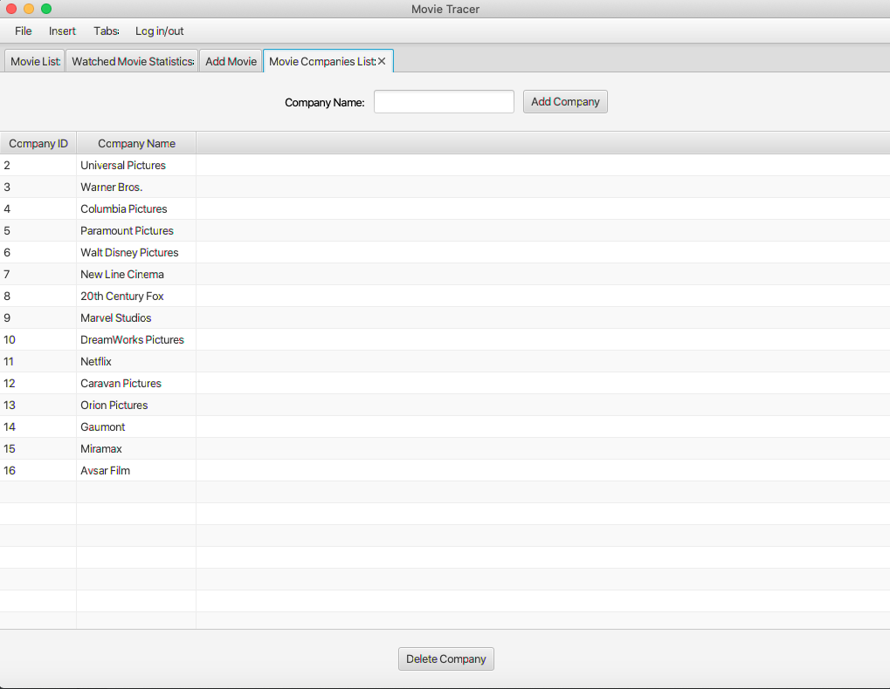
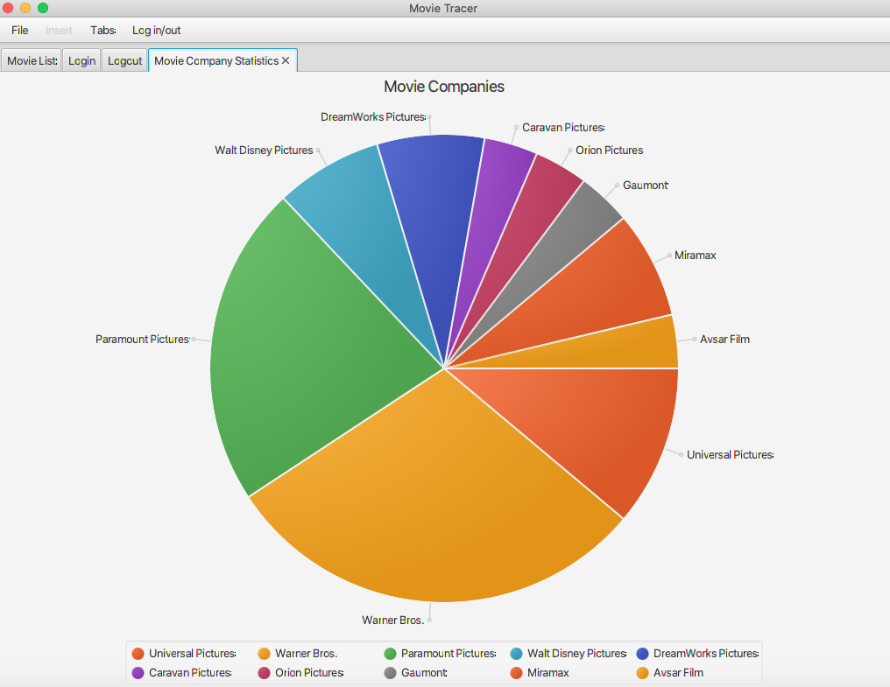
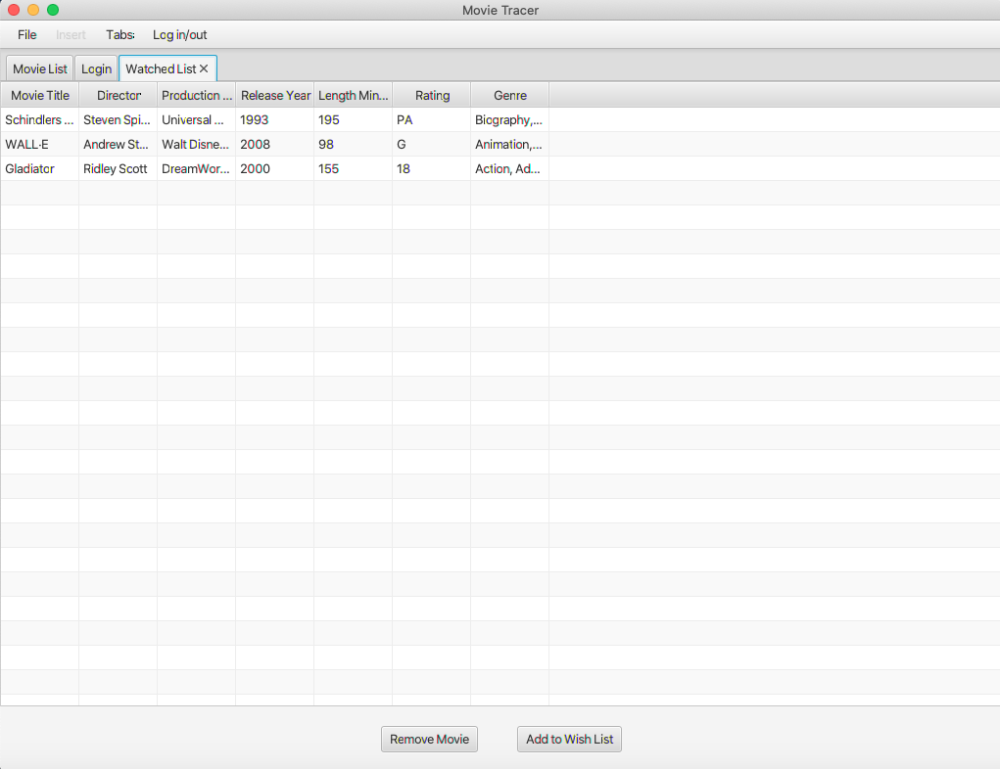

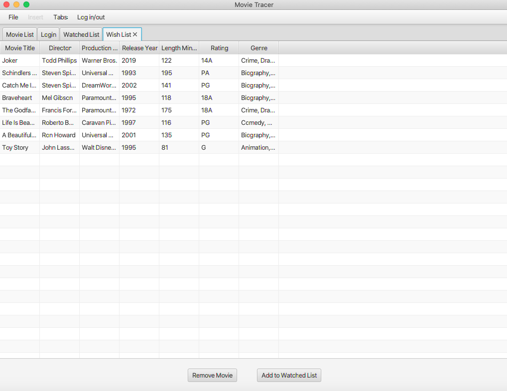
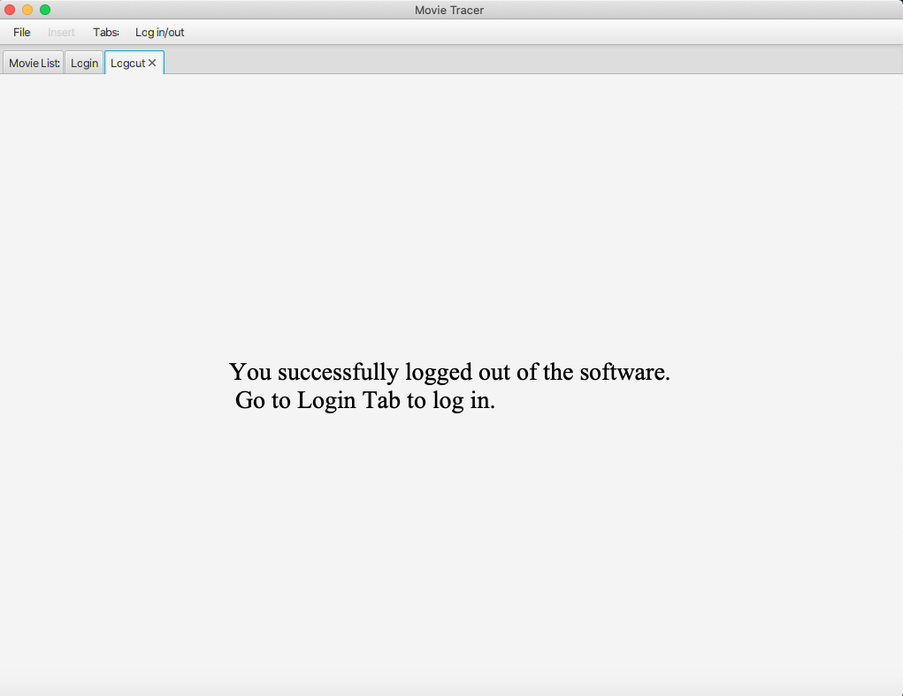

## Database schema’s
- MovieList Table (title, director, production company, release year, length in minutes, rating, genre).
- Watched List Table - manage watched movies (title, director, production company, release year, length 
     in minutes, rating, genre). Possibility to add/delete from the list by registered user and system admin only.
     Unavailable for unregistered user.
- Watched Movie Statistics. Watched movie list comparing to movie list in a pie chart. Unavailable for 
  unregistered user.
- Wishlist Table: manage wish list movies (title, director, production company, release year, length in 
     minutes, rating, genre). Possibility to add/delete from the list by registered user and system admin only. 
  Unavailable for unregistered user.
- Company List Table (companyId, company name). Possibility to add/delete company by system admin only.
  Unavailable to see for unregistered and registered users.
- Movie Company Statistics. Movie companies listed in MovieList table in a pie chart.
- Insert movie tab. Possibility to add movie by system admin only. Unavailable to see for unregistered and 
  registered users.

## Compatibility Chart
The software should be used on desktop ot laptop computer. 

## Authors
Ibrahim Osman, Elena Polyakova

## Acknowledgments
The project built using JavaFx, database phpmyadmin.scweb.ca and PUTTY to connect to the database.
Contributor: Câi Filiault
